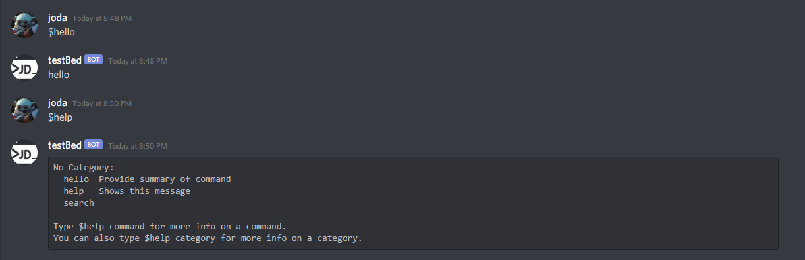

# Welcome to the world of Discord Bots
## Included here is a basic template for getting a Discord bot up and running in python utilizing the Discord.py library
I have also added in some of the required files to have this bot be hosted on Heroku with a PostgreSQL database backend.
  
#### In order to get this code up and running on your local machine:
1. Fork this repo
2. Initialize a virtual python environment
3. pip install -r requirements.txt
4. Create a new Discord application with a bot user attached.
5. Set your discord bots token into the .env file
6. Add .env to your .gitignore file
7. In the OAuth2 setting, generate a URL with a bot scope and copy that link into your browser
8. Select which of the servers you own to add the bot to
9. Run the main.py file!

### How to host this bot on Heroku with a PostgreSQL database backend for FREE:
1. Create the new application in Heroku either in the dashboard or CLI, and install the Heroku PostgreSQL add-on (The Hobby Dev tier should be sufficient for most needs)
2. Go into the application settings, and add your DISCORD_TOKEN as a new Config Var.
3. Copy the DATABASE_URL for your new postgres database and past that into your local .env file in order to run the connection locally. (Note that this url does change so you may have to update your local .env value every once in a while.)
4. Check that your Procfile points the worker to your main python file containing the bot run token.
5. I personally find it easiest to connect my application to the corresponding github repo, and have it automatically deploy with pushes to the repo, but your mileage may very.
6. Deploy it!

#### An example of the bot running:
